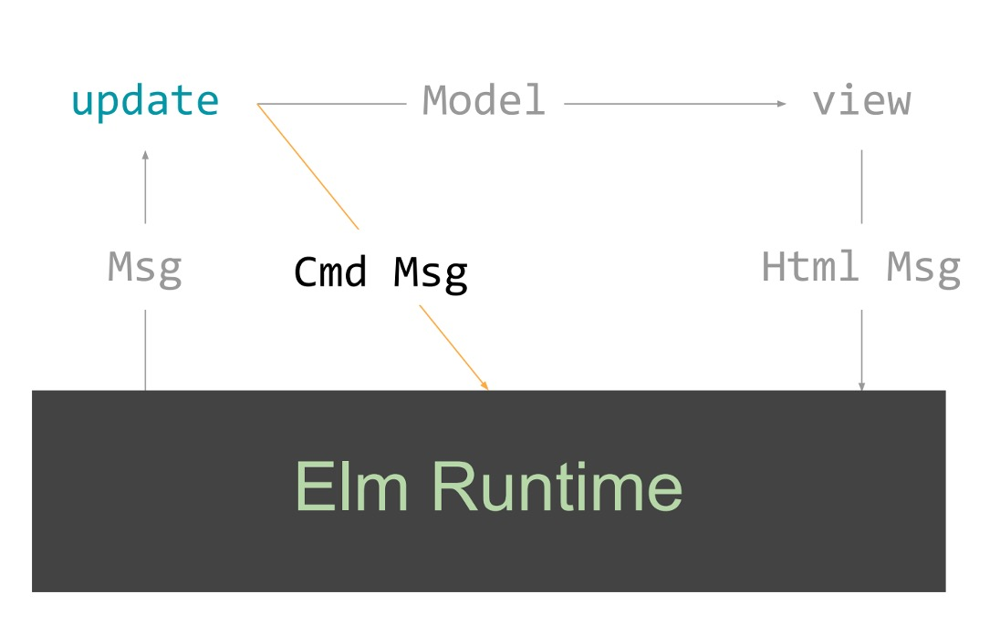

# **Elm is fun()**

## **Spustenie**

1. Nainštaluj Node.js podľa verzie v `.nvmrc`
2. Spusti `yarn` alebo `npm` a nainštaluj package
3. `yarn start` na spustenie lokálneho serveru
4. Otvor `http://localhost:1234`

## **Cieľ**

- ukázať Elm
- predviesť prečo je práca s elmom "fun"
- vytvoriť mini sandbox na hranie a experimenty

## **Ukázať Elm**

- nie je to JS framework
- functionálny programovací jazyk
- kompiluje sa do JavaScript-u
- malá veľkosť assetov
- žiadne runtime exceptions!
  <br></br>

- funkcionálny jazyk
- typový systém
- expresívny a jasný kód
- self-documenting
- robustný
- imutabilita

### **Lightning round**

- typy
- funkcie
- práca so stringami
- práca s listami
- všetko je funkcia
- pipelines and function composition

### **The Elm Architecture (TEA)**



## **Práca s elmom je "fun"**

### **Ďalšie "fíčury"**

- custom types (union types)
- type alias (records)
- Maybe
- pattern matching
  <br></br>

- možnosť definovať doménu pomocou custom types - Tile
- definícia dát pomocou type aliasov Model
- pattern matching
- kontrolované JS inter-ops
- compiler error messages ("TODO" list)
- elm-tooling (elm-review)

## **Mini sandbox na hranie a experimenty**

- Kto z Vás počul o hre Wordle?
- Kto z Vás hráva Wordle ?
- Kto z Vas sa pokúsil vytvoriť klon?

### **Wordle**

- 1 slovo - 5 písmen
- 6 pokusov
- každý pokus odhalí písmená v hádanom slove
- možnosť zazdielať výsledok

### **Úlohy**

1. Ukázať štruktúru kódu
2. Compiler - errory, todo list, ako sa pracuje s kódom
3. Pridať možnosť zdielania
4. elm-review (bonus)

```elm
port module Main exposing (Model, Msg, main)

-- Ports for JS inter-ops
port copyToClipboard : String -> Cmd msg

type Msg
    = TypeChar Int Char
    | CheckWord
    | ShareResult

view : Model -> Html Msg
view { state, numOfAttempts, won } =
    Html.div [ Attrs.class "h-full grid place-items-center" ]
        [ Html.div [ Attrs.class "w-50 grid grid-cols-5 gap-1" ]
            (state
                |> Array.toList
                |> List.concatMap (Array.indexedMap viewTile >> Array.toList)
            )
        , if won then
            Html.button
                [ Attrs.class "rounded bg-slate-400 p-2 text-white"
                , Events.onClick ShareResult
                ]
                [ Html.text "CONGRATS! 🎉 SHARE IT WITH THE WORLD!" ]

            else
            Html.button
                [ Attrs.class "rounded bg-slate-400 p-2 text-white"
                , Events.onClick CheckWord
                ]
                [ Html.text "ENTER" ]
        ]

tileToString : Tile -> String
tileToString tile =
    case tile of
        Empty ->
            "⬛"
        Incorrect _ ->
            "⬛"
        Present _ ->
            "🟨"
        Correct _ ->
            "🟩"


update : Msg -> Model -> ( Model, Cmd msg )
update msg model =
    case msg of
        ShareResult ->
            let
                stateString =
                    model.state
                        |> Array.filter ((/=) (Array.fromList [ Empty, Empty, Empty, Empty, Empty ]))
                        |> Array.map
                            (Array.map tileToString
                                >> Array.toList
                                >> String.join ""
                            )
                        |> Array.toList
                        |> String.join "\n"
            in
            ( model, copyToClipboard stateString )
```

```js
// Subscribe to port for JS inter-ops
// Copy the string from Elm to clipboard
app.ports.copyToClipboard.subscribe((sharedString) => {
  console.log(sharedString);
  navigator.clipboard.writeText(sharedString);
});
```

# **Credits**

- [Flavio Corpa](https://twitter.com/FlavioCorpa) za jeho jednoduchý základ hry [elm-wordle-twitch](https://github.com/kutyel/elm-wordle-twitch), ktorý vytvoril live na streame
- [Josh Wardle](https://twitter.com/powerlanguish) originálny autor hry [Wordle](https://www.powerlanguage.co.uk/wordle/)
- [Evan Czaplicki](https://twitter.com/evancz) autor [Elm](https://elm-lang.org/)
- [Jeroen Engels](https://github.com/jfmengels) za úžasný nástroj elm-review a common template [elm-review-common](https://github.com/jfmengels/elm-review-common/)
- [.NET Nalejvárna (Bratislava)](https://www.meetup.com/nalejvarna/events/285243726)
